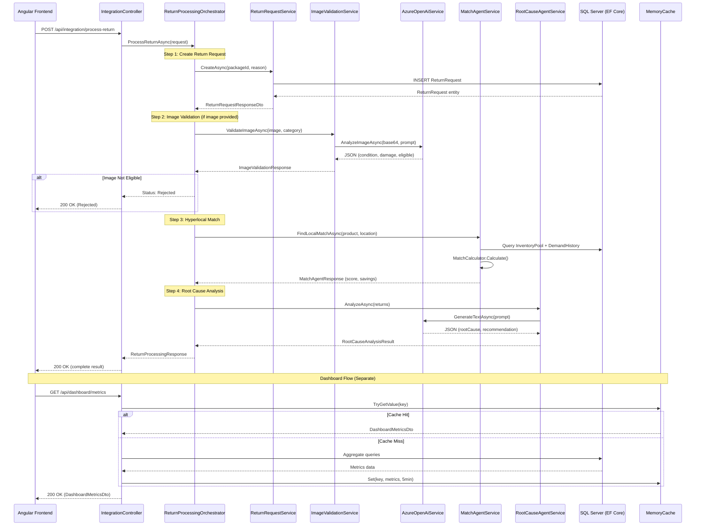
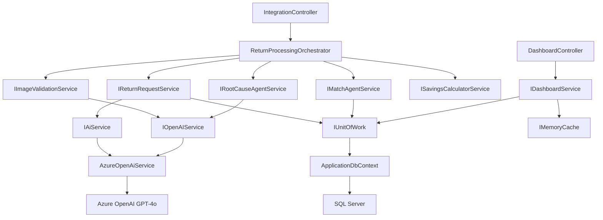

# UPS ReLoop Nexus - Integration Architecture

## System Overview

UPS ReLoop Nexus is an intelligent package return management system built on Clean Architecture with AI-powered agents for image validation, hyperlocal demand matching, and root cause analysis.

---

## Mermaid Sequence Diagram - Complete Integration Flow



---

## API Endpoints

| Method | Endpoint | Description | Controller |
|--------|----------|-------------|------------|
| POST | `/api/integration/process-return` | Full pipeline orchestration | IntegrationController |
| GET | `/api/dashboard/metrics` | KPI metrics with caching | DashboardController |
| POST | `/api/imagevalidation/validate` | Standalone image validation | ImageValidationController |
| POST | `/api/matchagent/find-match` | Standalone hyperlocal match | MatchAgentController |
| POST | `/api/rootcauseagent/analyze` | Standalone root cause analysis | RootCauseAgentController |
| GET | `/api/returnrequests/{id}` | Get return request by ID | ReturnRequestsController |
| POST | `/api/returnrequests` | Create return request | ReturnRequestsController |
| GET | `/api/packages/{id}` | Get package by ID | PackagesController |

---

## Request/Response Models

### POST `/api/integration/process-return`

**Request:**
```json
{
  "packageId": "guid",
  "productName": "string",
  "category": "string",
  "returnReason": "string",
  "location": "string",
  "imageBase64": "string (optional)",
  "additionalContext": "string (optional)"
}
```

**Response:**
```json
{
  "success": true,
  "message": "Return processed successfully through all agents.",
  "data": {
    "returnRequestId": "guid",
    "packageId": "guid",
    "status": "Matched | Eligible | Rejected",
    "imageValidation": {
      "condition": "Good",
      "damageScore": 15,
      "eligible": true,
      "confidence": 0.92,
      "remarks": "Minor scuffing on packaging"
    },
    "hyperlocalMatch": {
      "matchScore": 85,
      "recommendation": "Divert to local retailer",
      "confidence": 0.88,
      "explanation": "High demand in same zip code"
    },
    "rootCauseAnalysis": {
      "rootCause": "Size mismatch",
      "recommendation": "Improve size guide",
      "impact": "Could reduce returns by 15%"
    },
    "savings": {
      "distanceSavedKm": 50.0,
      "costSaved": 8.50,
      "co2SavedKg": 10.5
    },
    "processedAt": "2024-01-01T00:00:00Z"
  },
  "statusCode": 200
}
```

---

## Service Dependencies



---

## Dependency Injection Configuration

### Application Layer (`UPS.ReLoop.Application/DependencyInjection.cs`)
```csharp
services.AddMemoryCache();
services.AddScoped<IPackageService, PackageService>();
services.AddScoped<IReturnRequestService, ReturnRequestService>();
services.AddScoped<IImageValidationService, ImageValidationService>();
services.AddScoped<IMatchAgentService, MatchAgentService>();
services.AddScoped<IBusinessExplanationService, BusinessExplanationService>();
services.AddScoped<IRootCauseAgentService, RootCauseAgentService>();
services.AddSingleton<ISavingsCalculatorService, SavingsCalculatorService>();
services.AddScoped<IDashboardService, DashboardService>();
services.AddScoped<IReturnProcessingOrchestrator, ReturnProcessingOrchestrator>();
```

### Infrastructure Layer (`UPS.ReLoop.Infrastructure/DependencyInjection.cs`)
```csharp
services.AddDbContext<ApplicationDbContext>(options => options.UseSqlServer(...));
services.AddScoped<IUnitOfWork, UnitOfWork>();
services.AddScoped(typeof(IRepository<>), typeof(Repository<>));
services.AddScoped<IReturnRepository, ReturnRepository>();
services.AddScoped<IInventoryPoolRepository, InventoryPoolRepository>();
services.AddScoped<IDemandHistoryRepository, DemandHistoryRepository>();
services.AddScoped<IAgentRecommendationRepository, AgentRecommendationRepository>();
services.Configure<AzureOpenAiSettings>(configuration.GetSection("AzureOpenAI"));
services.AddScoped<AzureOpenAiService>();
services.AddScoped<IAiService>(sp => sp.GetRequiredService<AzureOpenAiService>());
services.AddScoped<IOpenAIService>(sp => sp.GetRequiredService<AzureOpenAiService>());
```

### Program.cs Registrations
```csharp
builder.Services.AddApplicationServices();    // All application services
builder.Services.AddInfrastructureServices(builder.Configuration);  // EF Core + Azure OpenAI
```

---

## Error Handling Strategy

| Layer | Mechanism | Behavior |
|-------|-----------|----------|
| **Global** | `GlobalExceptionHandlerMiddleware` | Catches all unhandled exceptions, returns structured `ApiResponse<object>` |
| **Domain** | `NotFoundException`, `BadRequestException`, `ConflictException` | Mapped to 404, 400, 409 |
| **Orchestrator** | Try/catch per agent | Individual agent failures don't crash pipeline; logged as warnings |
| **AI Service** | `ClientResultException` handling | Azure OpenAI failures wrapped in `InvalidOperationException` |
| **Validation** | `ArgumentException.ThrowIfNullOrWhiteSpace` | Fails fast on invalid input |

**Resilience Pattern in Orchestrator:**
- Each agent step is wrapped in try/catch
- If Image Validation fails ? continues pipeline (logs warning)
- If Match Agent fails ? marks as "Eligible" (logs warning)
- If Root Cause fails ? omits from response (logs warning)
- Only Return Request creation failure stops the pipeline

---

## Folder Structure

```
UPS_ReLoop_Nexus/
??? UPS_ReLoop_Nexus/                    # API Layer (Presentation)
?   ??? Controllers/
?   ?   ??? IntegrationController.cs     # Full pipeline orchestration
?   ?   ??? DashboardController.cs       # KPI metrics
?   ?   ??? ImageValidationController.cs # Standalone image validation
?   ?   ??? MatchAgentController.cs      # Standalone match
?   ?   ??? RootCauseAgentController.cs  # Standalone root cause
?   ?   ??? ReturnRequestsController.cs  # CRUD return requests
?   ?   ??? PackagesController.cs        # CRUD packages
?   ?   ??? BusinessExplanationController.cs
?   ??? Middleware/
?   ?   ??? GlobalExceptionHandlerMiddleware.cs
?   ??? Program.cs
?
??? UPS.ReLoop.Application/              # Application Layer (Use Cases)
?   ??? Common/
?   ?   ??? ApiResponse.cs
?   ?   ??? Exceptions/CustomExceptions.cs
?   ??? DTOs/
?   ?   ??? Integration/IntegrationDtos.cs
?   ?   ??? Dashboard/DashboardDtos.cs
?   ?   ??? ImageValidation/
?   ?   ??? MatchAgent/MatchAgentDtos.cs
?   ?   ??? RootCauseAgent/RootCauseDtos.cs
?   ?   ??? ReturnRequest/ReturnRequestDtos.cs
?   ?   ??? Package/PackageDtos.cs
?   ?   ??? Savings/SavingsDtos.cs
?   ??? Interfaces/
?   ?   ??? IReturnProcessingOrchestrator.cs
?   ?   ??? IDashboardService.cs
?   ?   ??? IImageValidationService.cs
?   ?   ??? IMatchAgentService.cs
?   ?   ??? IRootCauseAgentService.cs
?   ?   ??? IReturnRequestService.cs
?   ?   ??? IPackageService.cs
?   ?   ??? IAiService.cs
?   ?   ??? IOpenAIService.cs
?   ??? Services/
?   ?   ??? ReturnProcessingOrchestrator.cs
?   ?   ??? DashboardService.cs
?   ?   ??? ImageValidationService.cs
?   ?   ??? MatchAgentService.cs
?   ?   ??? RootCauseAgentService.cs
?   ?   ??? ReturnRequestService.cs
?   ?   ??? PackageService.cs
?   ??? DependencyInjection.cs
?
??? UPS.ReLoop.Domain/                   # Domain Layer (Entities)
?   ??? Common/BaseEntity.cs
?   ??? Entities/
?   ?   ??? Package.cs
?   ?   ??? ReturnRequest.cs
?   ?   ??? Return.cs
?   ?   ??? InventoryPool.cs
?   ?   ??? DemandHistory.cs
?   ?   ??? AgentRecommendation.cs
?   ??? Interfaces/
?       ??? IRepository.cs
?       ??? IUnitOfWork.cs
?       ??? ICustomRepositories.cs
?
??? UPS.ReLoop.Infrastructure/           # Infrastructure Layer
?   ??? Configuration/AzureOpenAiSettings.cs
?   ??? Persistence/
?   ?   ??? ApplicationDbContext.cs
?   ?   ??? Repository.cs
?   ?   ??? UnitOfWork.cs
?   ?   ??? Repositories/CustomRepositories.cs
?   ?   ??? Configurations/EntityConfigurations.cs
?   ??? Services/AzureOpenAiService.cs
?   ??? DependencyInjection.cs
?
??? UPS.ReLoop.Tests/                    # Test Layer
```

---

## Entity Framework Models

| Entity | Purpose | Key Relationships |
|--------|---------|-------------------|
| `Package` | Core shipment record | Has many `ReturnRequest` |
| `ReturnRequest` | Customer return initiation | Belongs to `Package` |
| `Return` | Completed return record | Processing outcome |
| `InventoryPool` | Local inventory availability | Used by Match Agent |
| `DemandHistory` | Historical demand data | Used by Match Agent |
| `AgentRecommendation` | AI agent decisions audit trail | Links to returns |

---

## Deployment Checklist

### Prerequisites
- [ ] Azure subscription with resource group
- [ ] Azure SQL Database provisioned
- [ ] Azure OpenAI resource with GPT-4o deployment

### Configuration (appsettings.json)
```json
{
  "ConnectionStrings": {
    "DefaultConnection": "Server=<server>.database.windows.net;Database=ReLoopNexus;..."
  },
  "AzureOpenAI": {
    "Endpoint": "https://<resource>.openai.azure.com/",
    "ApiKey": "<key>",
    "DeploymentName": "gpt-4o"
  },
  "Cors": {
    "AllowedOrigins": ["https://your-frontend.azurewebsites.net"]
  }
}
```

### Azure Resources
- [ ] Azure App Service (Linux, .NET 8)
- [ ] Azure SQL Database (Standard S2+)
- [ ] Azure OpenAI (GPT-4o, East US 2)
- [ ] Azure Key Vault (for secrets)
- [ ] Application Insights (telemetry)
- [ ] Azure Front Door (CDN + WAF)

### Deployment Steps
1. [ ] Run EF Core migrations: `dotnet ef database update`
2. [ ] Configure Key Vault references in App Service
3. [ ] Set `ASPNETCORE_ENVIRONMENT=Production`
4. [ ] Enable Application Insights connection string
5. [ ] Configure health checks endpoint
6. [ ] Deploy via GitHub Actions or Azure DevOps pipeline
7. [ ] Verify Swagger at `/swagger`
8. [ ] Run integration tests against staging
9. [ ] Configure auto-scaling rules (CPU > 70%)
10. [ ] Enable diagnostic logging

### Security
- [ ] Managed Identity for Key Vault + SQL
- [ ] API rate limiting (consider `AspNetCoreRateLimit`)
- [ ] CORS restricted to frontend domain only
- [ ] HTTPS enforced
- [ ] Input validation on all DTOs
- [ ] No secrets in appsettings (use Key Vault)

### Monitoring
- [ ] Application Insights for request telemetry
- [ ] Custom metrics for agent success/failure rates
- [ ] Alerts on 5xx error rate > 1%
- [ ] Dashboard for AI agent latency tracking
